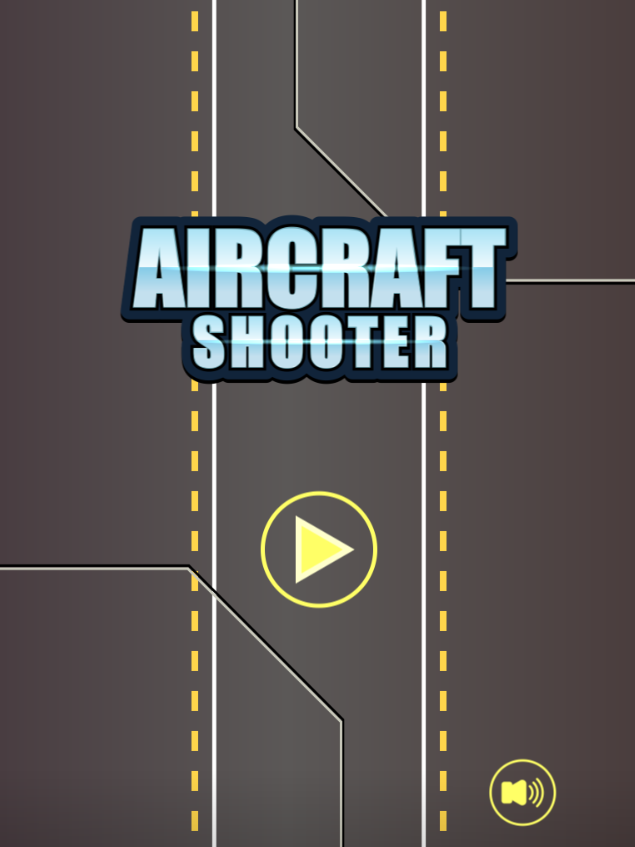
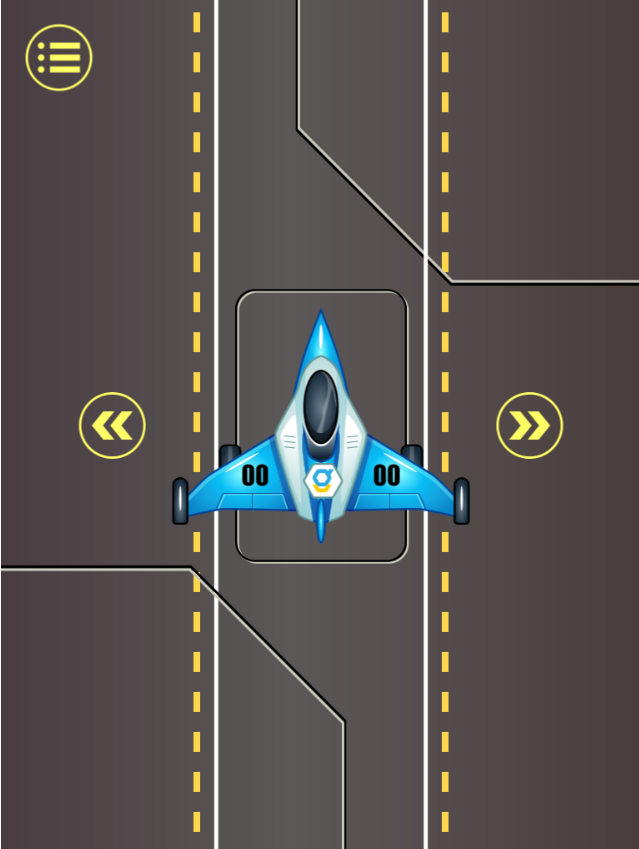
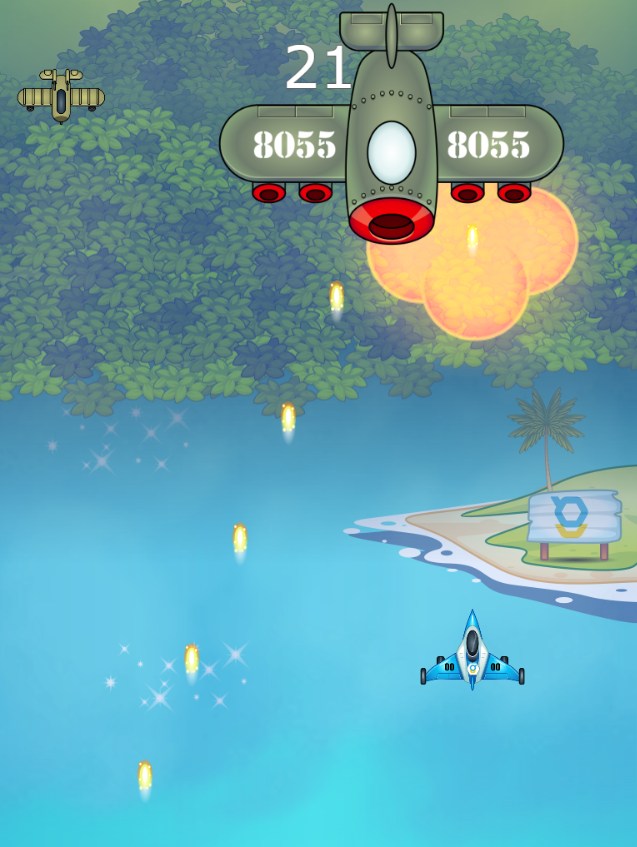
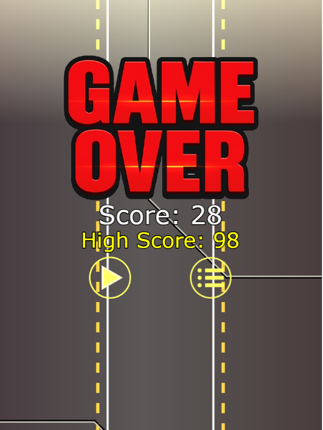
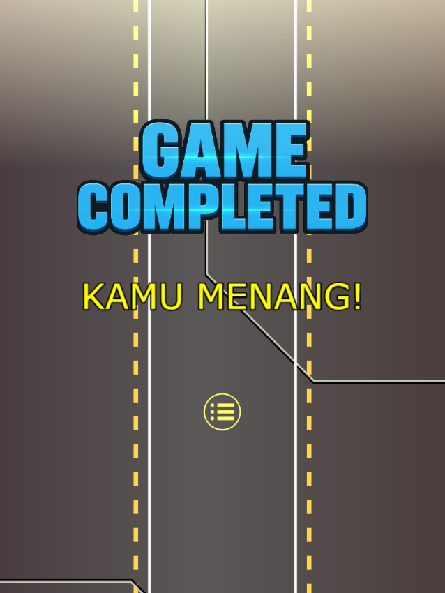

# 🔫 Shooter Game

Game 2D shooter sederhana yang dibuat dengan antarmuka interaktif dan gameplay seru. Pemain dapat memilih karakter, menembak musuh, dan bertahan untuk menang!

---

## 🎮 Tampilan Antarmuka

### 🧭 Menu Utama
Menu awal game yang memberikan pilihan untuk mulai bermain.



---

### 🧑‍🚀 Pilih Hero
Pilih karakter favoritmu sebelum memulai permainan.



---

### 🚀 Gameplay (Play)
Tampilan saat permainan berlangsung, di mana pemain dapat menggerakkan hero dan menembak musuh.



---

### 💀 Game Over
Tampilan yang muncul jika pemain kalah dalam permainan.



---

### 🏆 Kemenangan
Tampilan ketika pemain berhasil menang atau menyelesaikan game.



---

## ⚙️ Teknologi yang Digunakan

- Game Engine: [Contoh: Unity / Godot / LibGDX / HTML5 Canvas]
- Bahasa: [HTML / JavaScript ]
- Asset: Custom & open-source sprite assets

---

## 🚀 Cara Menjalankan

1. Clone repository ini:
   ```bash
   git clone https://github.com/username/shooter-game.git
